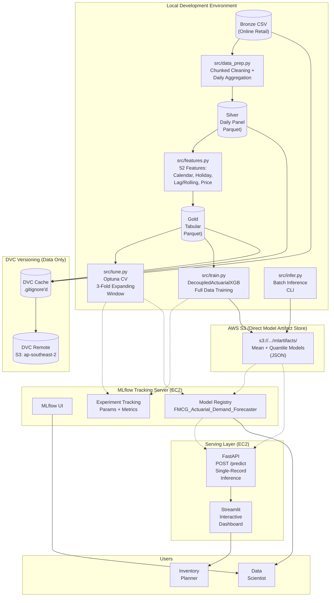

# System Architecture — FMCG Actuarial Demand Forecaster

**Architecture Type:** Decentralised MLOps with Direct-to-S3 Artifact Storage  
**Version:** 3.0.0  
**Infrastructure Stack:** AWS S3, MLflow (EC2), FastAPI, Streamlit, DVC

---

## 1. Architecture Diagram



---

## 2. Data Pipeline (Medallion Architecture)

```
Bronze ──► Silver ──► Gold
```

| Layer | Format | Path | Contents |
|---|---|---|---|
| **Bronze** | CSV | `data/bronze/online_retail.csv` | Raw transactional data (Invoice, StockCode, Quantity, Price, Country, Date) |
| **Silver** | Parquet | `data/silver/online_retail_daily_product.parquet` | Cleaned & aggregated daily panel: demand_qty, revenue, avg_price, num_invoices |
| **Gold** | Parquet | `data/gold/online_retail_daily_product_tabular.parquet` | Silver + 52 engineered features, zero-sale days filled, ready for modelling |

### 2.1 Bronze → Silver: `src/data_prep.py`

- Reads raw CSV in chunks of 200,000 rows.
- Filters: removes non-product codes (POST, DOT, GIFT_*, etc.), credit notes (C-prefix invoices), negative/zero quantity and price.
- Aggregates: `demand_qty = sum(Quantity)`, `revenue = sum(Quantity * Price)`, `avg_price = revenue / demand_qty`, `num_invoices = n_distinct(Invoice)` per (stock_code, country, date).
- Builds a full panel: daily resampling per item with zero-sale days filled via reindex. `avg_price` forward-filled for zero-sale days.

### 2.2 Silver → Gold: `src/features.py`

Computes 52 features across 4 groups. **All lag and rolling features are shifted by +1 to prevent data leakage.**

| Group | Count | Key Functions |
|---|---|---|
| Calendar & Holiday | 14 | `compute_calendar_features()` — day_of_week, month, quarter, holiday flags, etc. |
| Holiday Intensity | 4 | `compute_holiday_intensity_map()` — ratio of holiday demand to pre-holiday demand, computed per fold |
| Temporal Peak | 1 | `is_peak_day` — top 5% global demand days, computed per fold |
| Lag / Rolling | 33 | `compute_lag_rolling_features()` — lags 1–84 days, rolling stats, spike ratios, price momentum |

### 2.3 Zero Leakage Guarantee

| Technique | Implementation |
|---|---|
| **Lag shift** | All `demand_lag_N` use `groupby('item').shift(N + 1)` |
| **Rolling shift** | All rolling statistics use `.shift(1)` before join |
| **Per-fold computation** | `is_peak_day` and `holiday_intensity` computed exclusively from training data within each CV fold |
| **Tested** | `tests/test_leakage.py` asserts no future information leaks into features |

---

## 3. Model Training Pipeline

### 3.1 Hyperparameter Tuning: `src/tune.py`

- **Optimiser:** Optuna (TPE sampler, 100–200 trials).
- **Cross-validation:** 3-fold expanding window (train sizes: 180, 210, 240 days; validation: 30 days each).
- **Search space:** XGBoost parameters + actuarial parameters (`q_target`, `shortage_margin_multiplier`).
- **Objective:** Mean CLS across folds. Penalty of `1e6` if fold OFR < 0.80.
- **Logging:** Every trial logged to MLflow (params, metrics, feature importance).

### 3.2 Production Training: `src/train.py`

- Loads Gold data, filters `MIN_OBS >= 60`.
- Computes `is_peak_day` and `holiday_intensity` on full training data (leakage-safe).
- Trains `DecoupledActuarialXGB` on the full dataset.
- Saves artifacts: `mean_model.json`, `quant_model.json`, `model_config.json`.
- Optionally exports mean regressor to ONNX: `model.onnx` (skipped with `--skip-onnx`).
- Logs: MLflow run with params, metrics, and registered model name.

### 3.3 Model Registration

Automatic promotion to MLflow Model Registry (`FMCG_Actuarial_Demand_Forecaster`) if:

```
OFR >= 0.80  AND  CLS < 50,000
```

---

## 4. Direct-to-S3 Architecture

### 4.1 Problem

The MLflow tracking server runs on an AWS EC2 instance with limited memory (~8–16 GB RAM). Loading multiple large XGBoost model artifacts (each ~100–200 MB in serialised format) into EC2 local storage causes:

- **Out-of-Memory (OOM) errors** during concurrent model loading.
- **Disk space exhaustion** when multiple model versions accumulate.
- **Slow deployment** — copying artifacts from EC2 EBS to MLflow is I/O-bound.

### 4.2 Solution: Direct-to-S3

```
Training (Local) ──► S3 Artifact Store ──► MLflow Registry (pointer)
                                                        │
                                                        ▼
                                         FastAPI loads model from S3
                                         via MLflow's built-in S3 client
```

| Component | Storage Location | Access Method |
|---|---|---|
| Model artifacts (`mean_model.json`, `quant_model.json`, `config.json`) | **S3 bucket** | Direct `boto3` upload during training |
| MLflow metadata (params, metrics, experiment runs) | **MLflow Tracking Server** (EC2, SQLite/Postgres) | REST API via `MLFLOW_TRACKING_URI` |
| MLflow Model Registry (model version, stage, aliases) | **MLflow Tracking Server** (EC2) | REST API |
| DVC data files (Parquet datasets) | **S3 bucket** (separate prefix) | `dvc push / dvc pull` |

### 4.3 Benefits

| Benefit | Description |
|---|---|
| **Memory-efficient serving** | FastAPI loads model directly from S3 into memory — no intermediate disk writes |
| **Scalable artifact storage** | S3 provides unlimited storage for all model versions and experiment runs |
| **Decoupled lifecycle** | MLflow server can be restarted or replaced without losing model artifacts |
| **Cost-effective** | S3 standard storage at ~$0.023/GB/month vs. EC2 EBS at ~$0.10/GB/month |
| **Cross-environment access** | Same S3 bucket accessible from local dev, EC2 serving, and Kaggle notebooks |

### 4.4 S3 Bucket Layout

```
s3://dvc-demand-forecast-429321094404-ap-southeast-2-an/
├── storage/                     # DVC remote (data + models versioning)
│   ├── 2f/                      # DVC cache shard (MD5-hashed)
│   ├── ab/
│   └── ...
└── mlartifacts/                 # MLflow artifact store
    └── 1/                       # Experiment ID
        └── <run_id>/
            └── artifacts/
                ├── mean_model.json
                ├── quant_model.json
                └── model_config.json
```

---

## 5. Inference Serving

### 5.1 FastAPI (`api/main.py`)

| Endpoint | Method | Description |
|---|---|---|
| `/health` | GET | Returns model status (healthy/degraded), registry name, tracking URI |
| `/predict` | POST | Accepts `FeaturePayload` (52 features + metadata), returns `PredictResponse` |

**Model loading:** At startup, the API loads the latest registered model from MLflow:

```python
model_uri = f"models:/FMCG_Actuarial_Demand_Forecaster/latest"
_pipeline_model = mlflow.pyfunc.load_model(model_uri)
```

MLflow's S3 artifact client automatically resolves and downloads model files from S3.

**Environment variables required (from `.env`):**

```
MLFLOW_TRACKING_URI=http://forcaster.duckdns.org:5000
AWS_ACCESS_KEY_ID=<redacted>
AWS_SECRET_ACCESS_KEY=<redacted>
AWS_DEFAULT_REGION=ap-southeast-2
```

### 5.2 Streamlit UI (`app/ui.py`)

| Component | Function |
|---|---|
| **Sidebar controls** | Price (0–100 GBP), Calendar event checkboxes (Public Holiday, Peak Day, Promo) |
| **Main inputs** | Stock Code selector (15 predefined), Country selector (38 countries), Forecast Date picker |
| **Results display** | Expected Demand, Recommended Stock, Safety Buffer, Risk Status (STOCKOUT / OPTIMAL / OVERSTOCK), Coverage Ratio |
| **Technical view** | Expandable JSON payload viewer for debugging |

**Validation logic (risk status):**

| Condition | Risk Status |
|---|---|
| Coverage < 100% | STOCKOUT |
| Coverage 100% – 150% | OPTIMAL |
| Coverage > 150% | OVERSTOCK |

---

## 6. Data Versioning (DVC)

| Component | DVC Remote | Tracking |
|---|---|---|
| Bronze data (`online_retail.csv`) | `s3://.../storage` | `dvc add data/bronze/` |
| Silver data (`daily_product.parquet`) | `s3://.../storage` | `dvc add data/silver/` |
| Gold data (`tabular.parquet`) | `s3://.../storage` | `dvc add data/gold/` |

**Note:** Model artifacts are **not** tracked by DVC. They are stored directly on S3 via MLflow's Direct-to-S3 artifact store (see §4).

**Workflow:**
```bash
dvc pull              # Sync latest data from S3
dvc add data/silver/  # Register new data version
dvc push              # Upload to S3 remote
```

---

## 7. Configuration-Driven MLOps

The pipeline uses `configs/pipeline.yaml` as the single source of truth for environment-specific configuration:

| Variable | Default | Purpose |
|---|---|---|
| `dataset_version` | `online_retail_v1` | Logical dataset version tag logged to MLflow |
| `feature_set_id` | `fmcg_features_v52` | Identifier for the feature set (bumps when features change) |
| `cutoff_date` | `2011-12-09` | Data cutoff for training; filters out future rows |
| `random_seed` | `42` | Global seed for reproducibility |
| `mlflow_experiment` | `xgboost_demand_forecasting` | MLflow experiment name |
| `promotion_thresholds.ofr_min` | `0.80` | Minimum OFR for model registry promotion |
| `promotion_thresholds.cls_max` | `50000` | Maximum CLS for model registry promotion |

These values are loaded at runtime by `src/config.py` and logged to MLflow as parameters for full reproducibility.

---

## 8. Technology Stack

| Layer | Technology | Version |
|---|---|---|
| **Language** | Python | >= 3.12 |
| **ML Framework** | XGBoost | >= 2.0 |
| **Hyperparameter Tuning** | Optuna | >= 3.4 |
| **Experiment Tracking** | MLflow | >= 2.10 |
| **Data Versioning** | DVC | >= 3.0 |
| **Cloud Storage** | AWS S3 (ap-southeast-2) | — |
| **Serving API** | FastAPI | >= 0.115 |
| **Dashboard** | Streamlit | >= 1.35 |
| **Orchestration** | Custom Python (`run_pipeline.py`) | — |
| **Validation** | pytest + coverage | >= 8.0 |
| **Linting** | Ruff | >= 0.3 |

---

## 9. Pipeline Orchestration

The end-to-end pipeline is orchestrated via `run_pipeline.py`:

```bash
# Full pipeline (prep → features → tune → train)
python run_pipeline.py

# Skip tuning (use stored best params)
python run_pipeline.py --skip-tune

# Skip training (tune only)
python run_pipeline.py --skip-train

# Dry run (print commands without executing)
python run_pipeline.py --dry-run

# Clean MLflow and cache
python run_pipeline.py --cleanup

# Custom trial count
python run_pipeline.py --trials 200
```

Execution order:
1. `python -m src.data_prep` — Bronze → Silver
2. `python -m src.features` — Silver → Gold
3. `python -m src.tune` — Optuna CV + MLflow
4. `python -m src.train` — Final training + registration
